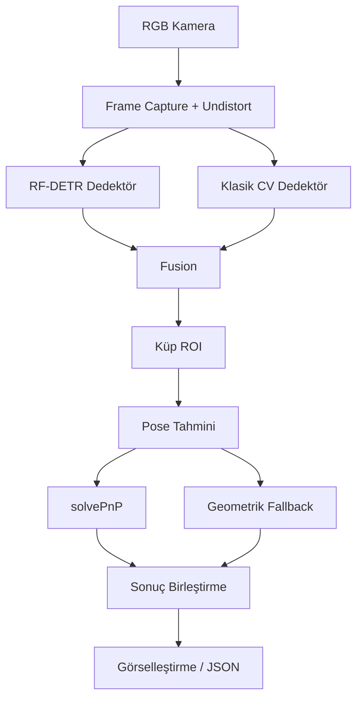

# TEKNOFEST 2026 Robolig - Küp Algılama ve Konumlandırma AI Sistemi

TEKNOFEST 2026 Robolig yarışması Üniversite kategorisi için geliştirilmiş, sıradan RGB kamera kullanan küp algılama, 3D konum ve yönelim tahmini sistemi.

## 📋 Özellikler

- **Küp Algılama**: RF-DETR + klasik CV hibrit dedektör
- **3D Konum Tahmini**: Monoküler kamera ile solvePnP + geometrik fallback
- **Yönelim Tespiti**: Euler açıları (Roll, Pitch, Yaw)
- **Robot Çıktı Modları**: JSON / Serial / Socket / stdout (`test/test_output.py`, `src/pipeline/output.py`)
- **Tek Sınıf**: Sadece `cube` sınıfı algılama
- **Gerçek Zamanlı Demo**: Canlı kamera akışında düşük gecikmeli çalışma

## 🛠️ Kurulum

### Gereksinimler

- Python 3.11+
- Windows/Linux
- RGB kamera (USB veya yerleşik)
- (Opsiyonel) GPU eğitim için

### Bağımlılıkları Yükle

```powershell
pip install -r requirements.txt
```

### Dataset Hazırlama İçin Ek Hazırlık

Kaggle dataseti için API anahtarı gerekir. `kaggle.json` dosyanızı aşağıdaki konumlardan birine yerleştirin:

- Windows: `%USERPROFILE%\.kaggle\kaggle.json`
- Linux/macOS: `~/.kaggle/kaggle.json`

Roboflow datasetlerini çekmek için API anahtarını ortam değişkeni olarak tanımlayın:

```powershell
$env:ROBOFLOW_API_KEY="your_api_key"
```

Ardından ham dataset klasörlerini `data/raw/` altına yerleştirip RF-DETR için COCO dataset oluşturmak için:

```powershell
python scripts/prepare_datasets.py --coco
```

### Dizin Yapısı

```
.
├── README.md
├── requirements.txt
├── config/                  # YAML konfigürasyonlar
│   ├── base.yaml
│   ├── camera.yaml
│   ├── detection.yaml
│   ├── data.yaml
│   ├── demo.yaml
│   ├── output.yaml          # Çıktı modları konfigürasyonu
│   └── pose.yaml
├── data/
│   ├── raw/                 # Ham veri kaynakları (v1, v2, ...)
│   ├── processed/           # Birleştirilmiş/işlenmiş veri
│   └── test_images/         # Test görselleri
├── model/                   # Eğitilmiş modeller
│   └── rf_detr_cube_detector.pth  # RF-DETR modeli
├── scripts/                 # Executable scriptler
│   ├── calibrate_camera.py
│   ├── train_detector.py
│   ├── run_camera_demo.py
│   └── prepare_datasets.py
├── test/                    # Test ve doğrulama scriptleri
│   ├── run_test_inference.py
│   ├── test_all_modules.py
│   ├── test_fallbacks.py
│   └── test_output.py
├── src/                    # Ana kaynak kodlar
│   ├── camera/             # Kamera arayüzü
│   ├── calibration/        # Kalibrasyon
│   ├── detection/          # Algılama (RF-DETR + klasik CV)
│   ├── pose/               # 3D pose tahmini
│   ├── pipeline/           # Sonuç birleştirme ve görselleştirme
│   ├── tracking/           # (opsiyonel) BoxMOT takip adaptörü
│   └── utils/              # Yardımcı modüller
└── docs/                   # Dokümantasyon
```

## 🚀 Hızlı Başlangıç

### 1. Kamera Kalibrasyonu

Önce kameranızı kalibre edin (monoküler 3D konum tahmini için zorunlu):

```powershell
python scripts/calibrate_camera.py
```

- 9x6 checkerboard paterni yazdırın (25mm kare boyutu)
- Checkerboard'u farklı açı ve mesafelerden gösterin
- **SPACE** tuşu ile görüntü yakalayın (minimum 15, hedef 30)
- **Q** tuşu ile bitirin
- `camera_calibration.npz` dosyası oluşturulacak

### 2. Demo Çalıştırma

Gerçek zamanlı demo:

```powershell
python scripts/run_camera_demo.py --calibration camera_calibration.npz --output-mode stdout
```

**Kontroller:**
- **Q**: Çıkış
- **SPACE**: Duraklat/Devam
- **S**: Frame kaydet

### 2.1 BoxMOT ile Kalıcı Küp ID

Küplere frame'ler arası sabit ID vermek için BoxMOT entegrasyonu `config/detection.yaml` içindeki `detection.tracking` bölümünden yönetilir:

```yaml
detection:
  tracking:
    enabled: true
    tracker_type: "bytetrack"
    tracker_backend: "python"
    reid_weights: null
```

Hızlı deneme için sadece `tracker_type` alanını değiştirin:

- `bytetrack`: hızlı, ReID modeli gerektirmez; başlangıç için önerilir.
- `ocsort` / `sfsort`: hızlı hareket tabanlı alternatifler.
- `botsort`, `strongsort`, `deepocsort`, `hybridsort`, `boosttrack`, `occluboost`: görünüş/ReID bilgisi kullanabilen tracker'lar; gerekirse `reid_weights` alanına model yolu verin.

Koddan denemek için:

```python
from src.api import RoboligDetector

detector = RoboligDetector(
    config_dir="config/",
    enable_tracking=True,
    tracker_type="bytetrack",
)
result = detector.detect(frame)

for cube in result.cubes:
    print(cube.detection.track_id, cube.detection.bbox)
```

JSON çıktısındaki `cubes[].id` alanı BoxMOT ID'sidir. Tracking kapalıysa veya tracker henüz bir tespit için ID üretmediyse mevcut frame içi indeks kullanılır.

### 3. Model Eğitimi

RF-DETR modeli eğitimi:

```powershell
python scripts/prepare_datasets.py --coco
python scripts/train_detector.py
```

Dataset hazırlama ve birleştirme scripti şu klasör yapısını üretir:

```text
data/
├── raw/
│   ├── kaggle/
│   └── roboflow/
└── processed/
    ├── unified/
    │   ├── images/
    │   │   ├── train/
    │   │   ├── val/
    │   │   └── test/
    │   ├── labels/
    │   │   ├── train/
    │   │   ├── val/
    │   │   └── test/
    │   ├── data.yaml
    │   ├── stats.json
    │   └── dataset_report.md
    └── coco/
        ├── train/
        │   └── _annotations.coco.json
        └── valid/
            └── _annotations.coco.json
```

Birleştirme sırasında tüm kaynak etiketler tek `cube` sınıfına indirgenir.

Bu yapı COCO eğitim veri setini tek sınıf (`cube`) olacak şekilde standartlaştırır.

### 4. Model Bilgisi

Model RF-DETR tabanlıdır ve `config/detection.yaml` ile `config/data.yaml` üzerinden yapılandırılır:
- **Model Tipi**: `config/detection.yaml` içindeki `detection.rf_detr.model_size` (`base` veya `large`)
- **Eğitim Parametreleri**: `config/data.yaml` içindeki `training.rf_detr` bölümü
- **COCO Eğitim Veri Seti**: Tek sınıf (`cube`)
- **Model Dosyası**: `model/rf_detr_cube_detector.pth`

## 📐 Konfigürasyon

Tüm parametreler `config/` altındaki YAML dosyalarından yönetilir.

### Önemli Ayarlar

#### `config/camera.yaml`
- Kamera çözünürlüğü, FPS
- Manuel exposure (motion blur önleme)
- Kalibrasyon dosyası yolu

#### `config/detection.yaml`
- RF-DETR model yolu ve parametreleri
- Klasik CV eşikleri
- Fusion ve tracking ayarları

#### `config/base.yaml`
- Küp boyutu (9cm)
- 3D model noktaları
- Performans hedefleri

## 🎯 Sistem Mimarisi



### Modüller

| Modül | Sorumluluk |
|-------|-----------|
| `camera` | OpenCV kamera erişimi, yeniden bağlanma |
| `calibration` | Kamera kalibrasyon I/O, undistortion |
| `detection` | RF-DETR + klasik CV hibrit algılama |
| `pose` | solvePnP + geometrik 3D konum/yönelim |
| `pipeline` | Sonuç birleştirme, görselleştirme |

## 🔬 Teknik Detaylar

### Algılama Stratejisi

**Hibrit Yaklaşım:**    
1. **Birincil**: RF-DETR (0.5 confidence threshold)
2. **Fallback**: Klasik CV kontur analizi (model boş sonuç veya düşük güvenli algılama döndürdüğünde)

**Fusion Kuralları:**
- Sinir ağı başarısızsa veya düşük güvenli algılama varsa klasik CV devreye girer
- NMS ile çakışan algılamalar temizlenir

### 3D Konum Tahmini

**Monoküler Kamera Kısıtı:**
- Derinlik sensörü olmadığı için bilinen küp boyutu (9cm) kullanılır

**İki Yöntem:**
1. **solvePnP** (öncelikli):
   - Küp yüz köşeleri tespit edilir
   - 3D model noktaları ile eşleştirilir
   - Kamera matris ile 6-DoF pose hesaplanır

2. **Geometrik Fallback**:
   - solvePnP başarısızsa
   - Hough Lines + contour fallback yönelim sistemi kullanılır (artık sadece aspect ratio değil)
   - Merkez pikselden X, Y hesaplanır

## 📊 Veri Stratejisi

### Sentetik Veri

- 9x9x9 cm küp 3D modeli ile render
- 500 görüntü üretildi (`scripts/generate_synthetic_data.py`)
- Domain randomization:
  - Farklı pozlar, açılar, mesafeler
  - Blur, noise, brightness, contrast
  - Arka plan varyasyonları

### Augmentation

`albumentations` kütüphanesi:
- Hue/saturation shift
- Perspective transform
- Cutout/occlusion
- Motion blur

## 🧪 Test ve Doğrulama

### Kalibrasyon Kalitesi
- Reprojection error < 0.5 piksel

### Algılama
- Offline video/frame testi
- Precision/Recall ölçümü

### Konum Tahmini
- Bilinen mesafelerde (50-150cm) hata ölçümü
- Hedef: ±3cm @ 1m

### Latency
- Hedef: <50ms/frame (≥20 FPS)
- Mini PC/laptop hedefi için optimize edilmiş

## ⚠️ Bilinen Sınırlar

1. **Işık Değişkenliği**: HSV aralıkları yarışma sahası ışığına göre kalibre edilmelidir
2. **Tek Kamera**: Derinlik tahmini küp boyutuna bağımlı; küp kısmen görünürse hata artar
3. **Model Yokluğu**: İlk çalıştırmada RF-DETR modeli olmayacak, yalnızca klasik CV çalışır
4. **Yönelim Belirsizliği**: 4 köşe görünmüyorsa yönelim güveni düşük

## 🔧 Sorun Giderme

### Kamera açılmıyor
- Device index kontrolü (`config/camera.yaml` → `device_index`)
- Kamera izinleri (Windows/Linux)

### Düşük FPS
- Çözünürlük düşürün (`camera.yaml` → `width/height`)
- Frame skip aktifleştirin
- ONNX runtime kullanın (GPU varsa)

### Model bulunamadı hatası
- İlk kurulumda normal (klasik CV kullanılacak)
- Model eğitmek için veri hazırlandığında `train_detector.py` çalıştırın

## 📝 Lisans ve İletişim

TEKNOFEST 2026 Robolig yarışması için geliştirilmiştir.

---

**Not**: Bu sistem yalnızca görüntü işleme ve AI algılama katmanını içerir. Mekanik robot kontrolü, navigasyon ve görev stratejisi dahil değildir.

## Kalan İşler (Yarışma Öncesi)

### Kamera Kalibrasyonu
- **Ne:** Kameranın mesafeyi doğru ölçmesi için bir kerelik ayar
- **Neden:** Şu an sistem 'tahmini' mesafe veriyor, kalibrasyon yapınca gerçek mesafeyi verir
- **Nasıl:** 
  1. Bir satranç tahtası deseni yazdır (A4 kağıda, 9x6 kareli - internetten 'checkerboard pattern 9x6' ara ve yazdır)
  2. Komutu çalıştır: `python scripts/calibrate_camera.py`
  3. Kağıdı kameranın önünde farklı açılardan göster
  4. Her pozisyonda SPACE tuşuna bas (en az 15 farklı pozisyon)
  5. Q tuşuna basıp bitir
  6. `camera_calibration.npz` dosyası oluşacak - bu kalibrasyonun sonucu

### Canlı Kamera Testi
- **Ne:** Gerçek kamerayla sistemi test etme
- **Nasıl:**
  1. USB kamerayı bilgisayara tak
  2. Komutu çalıştır: `python scripts/run_camera_demo.py`
  3. Küpü kameranın önüne koy
  4. Ekranda küpün etrafında kutu, güven skoru, mesafe ve açı bilgileri görünecek
  5. Q tuşuyla çık

### Yarışma Ortamı Testi  
- **Ne:** Gerçek yarışma alanına benzer ortamda test
- **Nasıl:**
  1. Küpleri düz bir zemine koy (yarışmadaki gibi)
  2. Kamerayı robotun bakacağı açıya/yüksekliğe koy
  3. Demo'yu çalıştır ve sonuçları gözlemle

### Robot Entegrasyonu
- **Ne:** AI sistemini robotun motorlarına bağlama
- **Nasıl:**
  1. `config/output.yaml` dosyasında çıktı modunu seç (`stdout`/`jsonl`/`serial`/`socket`)
  2. `python test/test_output.py` ile çıktının doğru geldiğini kontrol et
  3. Robotun kontrol kartına bağla
