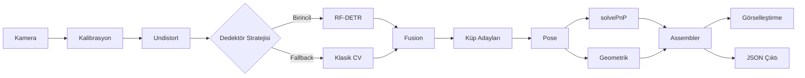

# Sistem Mimarisi

TEKNOFEST 2026 Robolig AI Sistemi - Teknik Mimari Dokümantasyon

## Genel Bakış

Bu sistem, sıradan RGB kamera kullanan monoküler görüntü işleme pipeline'ıdır. Tek sınıf (`cube`) küp algılama ve 3D konum/yönelim tahmini sağlar.

## Veri Akışı



## Katman Yapısı

### 1. Algılama Katmanı (Detection Layer)

**Sorumluluk:** Görüntüde küpün 2D bbox tespiti

**Bileşenler:**
- `RFDETRDetector`: RF-DETR sinir ağı inference
- `ClassicalDetector`: HSV + kenar + kontur analizi
- `FusionDetector`: İki dedektörü birleştirme

**Fusion Mantığı:**
```
IF RF-DETR boş sonuç VEYA düşük güven:
    Klasik CV çalıştır
    
Sonuçları birleştir:
    RF-DETR öncelikli
    NMS ile çakışmaları temizle
```

**Çıktı:**
```python
DetectorOutput(
    bboxes: List[BoundingBox],
    classes: List[DetectionClass],  # CUBE
    confidences: List[float], # Güven Skoru
    class_names: List[str]
)
```

### 2. Pose Tahmini Katmanı (Pose Estimation Layer)

**Sorumluluk:** Küpün 3D pozisyon ve yönelimini hesaplama

#### 3.1 solvePnP Yöntemi (Birincil)

**Gereksinim:** 4 köşe noktası tespit edilmeli

**Adımlar:**
1. ROI içinde Canny kenar tespiti
2. Kontur bulma ve dörtgen yaklaşıklama
3. 4 köşe noktası çıkarımı
4. 3D model noktaları ile eşleştirme:
   ```
   3D küp yüzü (metre):
   [-0.045, -0.045, 0]  # Sol üst
   [ 0.045, -0.045, 0]  # Sağ üst
   [ 0.045,  0.045, 0]  # Sağ alt
   [-0.045,  0.045, 0]  # Sol alt
   ```
5. `cv2.solvePnP()` ile rvec, tvec hesaplama
6. Rotasyon matrisinden Euler açıları

**Euler Açıları:**
```python
R = cv2.Rodrigues(rvec)
roll = atan2(R[2,1], R[2,2])
pitch = atan2(-R[2,0], sqrt(R[0,0]^2 + R[1,0]^2))
yaw = atan2(R[1,0], R[0,0])
```

#### 3.2 Geometrik Fallback (İkincil)

**Kullanım:** solvePnP başarısızsa

**Derinlik Hesabı:**
```
Z = (f × W_real) / W_pixel

Z: derinlik (metre)
f: focal length (piksel)
W_real: küp gerçek boyutu (0.09 m)
W_pixel: bbox genişliği (piksel)
```

**X, Y Hesabı:**
```
X = (u - cx) × Z / fx
Y = (v - cy) × Z / fy

(u, v): bbox merkez pikseli
(cx, cy): kamera merkezi
```

**Yönelim:** Belirsiz, varsayılan (0, 0, 0)

**Çıktı:**
```python
PoseEstimateResult(
    position_x, position_y, position_z: float,
    roll, pitch, yaw: float,
    position_confidence: float,
    orientation_confidence: float,
    method: "solvepnp" | "geometric_bbox"
)
```

### 3. Sonuç Birleştirme Katmanı (Assembly Layer)

**Sorumluluk:** Tüm modül çıktılarını tek yapıda birleştirme

**İşlem Akışı:**
```
FOR her algılama:
    IF küp:
        Pose tahmin et (PnP → geometrik fallback)
        CubeDetectionResult oluştur

FrameAnalysisResult döndür
```

**Çıktı:**
```python
FrameAnalysisResult(
    cubes: List[CubeDetectionResult],
    timestamp: float,
    frame_id: int
)
```

## Performans Optimizasyonları

### 1. Kamera Buffer Yönetimi
- Buffer boyutu = 1 (sadece son frame)
- Gecikme minimizasyonu

### 2. Undistortion Haritaları
- Kalibrasyon yüklenirken ön-hesaplama
- Her frame'de `cv2.remap()` ile hızlı uygulama

### 3. RF-DETR Inference
- `base` veya `large` model seçeneği
- COCO formatında tek `cube` sınıfı ile eğitim
- CUDA/CPU desteği

### 4. Klasik CV
- Sadece fallback gerektiğinde çalıştırma
- Morfolojik işlemler minimum kernel

## Hata Yönetimi

### Kalibrasyon Yoksa
- `pose` ve `undistort` devre dışı
- Algılama devam eder (sadece 2D)

### Model Yoksa
- RF-DETR devre dışı
- Klasik CV tam zamanlı çalışır

### Kamera Koparsa
- Otomatik yeniden bağlanma (3 deneme)
- 2 saniye bekleme

## Konfigürasyon Yönetimi

### YAML Hiyerarşisi
```
base.yaml          → Küp boyutu, sistem sabitleri
camera.yaml        → Kamera ayarları, kalibrasyon
detection.yaml     → Dedektör parametreleri
data.yaml          → Veri/eğitim ayarları
demo.yaml          → Görselleştirme, çıktı
output.yaml        → Çıktı modları
pose.yaml          → Pose tahmini parametreleri
```

### Merge Stratejisi
```python
config = merge_configs("base", "camera", "detection", "data", "demo", "output", "pose")
# Sonraki öncelikli (override)
```

## Genişletilebilirlik

### Yeni Dedektör Ekleme
1. `BaseDetector`'dan türet
2. `detect()` metodunu implement et
3. `FusionDetector`'a ekle

### Yeni Pose Yöntemi
1. `pose/` altında yeni modül
2. `PoseEstimateResult` döndür
3. `assembler.py`'de çağır

## Test ve Doğrulama

### Birim Testler
- Her modül bağımsız test edilebilir
- Mock kamera/kalibrasyon desteği

### Entegrasyon Testi
- `run_camera_demo.py` ile end-to-end
- Kaydedilmiş video üzerinde replay

### Benchmark
```
Hedef: ≥20 FPS @ 1280x720
Latency: <50ms/frame
```

## Güvenlik ve Kararlılık

### Hata Kurtarma
- Tüm modüller exception-safe
- Logging ile izlenebilirlik

### Sınır Kontrolleri
- Bbox görüntü dışına taşma koruması
- Sıfıra bölme kontrolleri
- NaN/Inf filtreleme

---

**Not:** Bu mimari, yarışma gününde alan kısıtlamaları ve gereksinimlere göre konfigürasyon değişiklikleri ile hızlı adapte edilebilir tasarlanmıştır.
